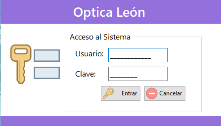
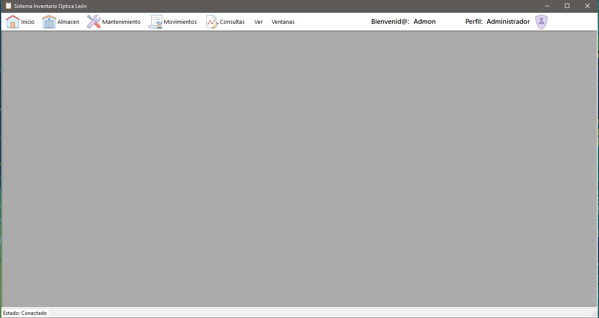
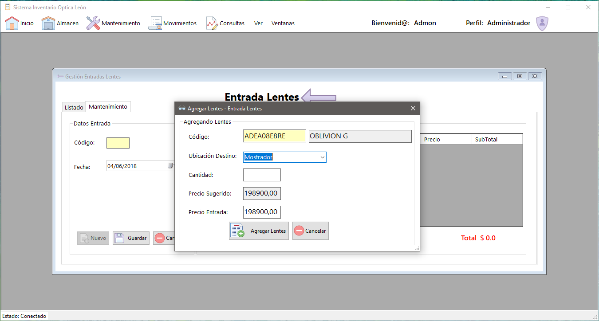
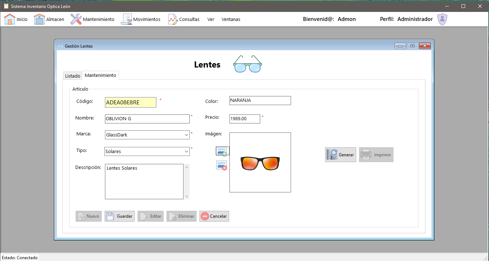
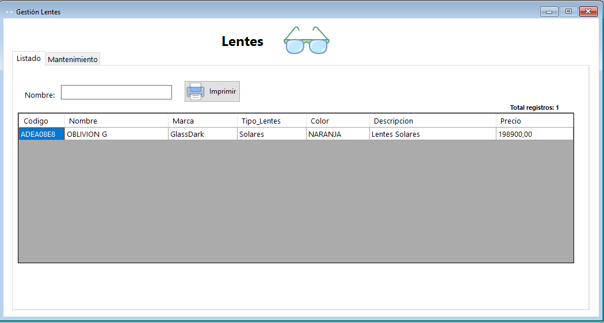
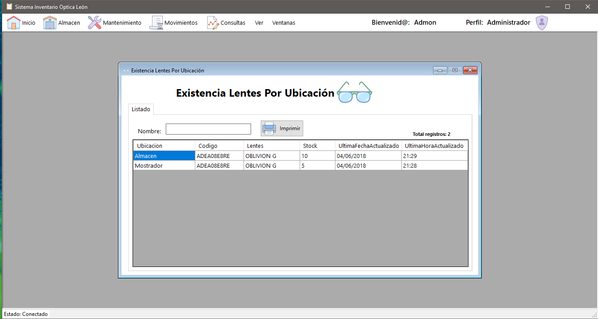

# Control de Inventarios para Optica C# & SQL Server

Control de inventarios para una optica, que permite gestionar productos, ubicaciones, clientes, salidas, entradas, ajustes, movimientos.

# Configuración
### Base de Datos
  - Crear una base de datos en SQL Server con el nombre que quieras, en mi caso se llama `BD_OpticaLeon`
  - Ejecutar el [script](DataBase/Tables_OpticaLeon.sql) y los [stored procedure](DataBase/StorageP_OpticaLeon.sql) completo en la base de datos recien creada.

### Visual Studio
  - Abrir la Solucion del proyecto en Visual Studio
  - Clic derecho en la solución y luego en **Configuración**, editar la linea de acuerdo a tu instancia de SQL y tu BD:

  `Data Source=INSPIRON-ISIDRO\SQLEXPRESS;Initial Catalog=BD_OpticaLeon;Integrated Security=True`.

### Librerias utilizadas
  - [BarCodeLib](https://github.com/barnhill/barcodelib) - Generar códigos de barras

# Screenshots
  
 
  
 
  
 
 
  
 
 
 

Version 1.0
----
  - Permite:
    * Gestionar toda la información de los productos así como generar e imprimir el código de barras del mismo.
    * Gestionar las ubicaciones de almacenamiento de los productos.
    * Gestionar todo el flujo de movimiento de los productos , ya sean:
    * * Salidas
    * * Entradas
    * * Movimientos
    * * Ajustes de almacen.
    * Crear y administrar difrentes tipos de usuarios dentro del sistema.
    * Crear y administrar clientes.
    * Reportes de salidas, entradas, movimientos y ajustes por producto, ubicación y fecha.

License
----
MIT

**Free Software, Hell Yeah!**

